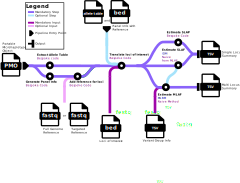

<h1>
  <picture>
    <source media="(prefers-color-scheme: dark)" srcset="docs/images/nf-core-plasmodiumdrugres_logo_dark.png">
    
  </picture>
</h1>

[](https://github.com/codespaces/new/nf-core/plasmodiumdrugres)
[](https://github.com/nf-core/plasmodiumdrugres/actions/workflows/nf-test.yml)
[](https://github.com/nf-core/plasmodiumdrugres/actions/workflows/linting.yml)[](https://nf-co.re/plasmodiumdrugres/results)[](https://doi.org/10.5281/zenodo.XXXXXXX)
[](https://www.nf-test.com)

[](https://www.nextflow.io/)
[](https://github.com/nf-core/tools/releases/tag/3.5.2)
[](https://docs.conda.io/en/latest/)
[](https://www.docker.com/)
[](https://sylabs.io/docs/)
[](https://cloud.seqera.io/launch?pipeline=https://github.com/nf-core/plasmodiumdrugres)

[](https://nfcore.slack.com/channels/plasmodiumdrugres)[](https://bsky.app/profile/nf-co.re)[](https://mstdn.science/@nf_core)[](https://www.youtube.com/c/nf-core)

## Introduction

**nf-core/plasmodiumdrugres** is a bioinformatics pipeline for analyzing drug resistance markers from microhaplotype data. It translates variants into amino acid changes at drug resistance loci and estimates allele frequencies and prevalences at both single-locus and multi-locus levels. Microhaplotype data can be supplied in the form of an allele table or a [PMO](https://plasmogenepi.github.io/PMO_Docs/) file.



1. Translate loci of interest ([`PGEcore`](https://github.com/PlasmoGenEpi/PGEcore))
2. Split by population
3. Estimate allele prevalence ([`PGEcore`](https://github.com/PlasmoGenEpi/PGEcore))
4. Estimate multilocus allele frequency. Choice of method between:
   1. [MultiLociBiallelicModel](https://www.frontiersin.org/articles/10.3389/fepid.2022.943625/full) ([`PGEcore` wrapper script](https://github.com/PlasmoGenEpi/PGEcore))
   2. [FreqEstimationModel](https://doi.org/10.1186/1475-2875-13-102) ([`PGEcore` wrapper script](https://github.com/PlasmoGenEpi/PGEcore))
   3. Naive method ([`PGEcore`](https://github.com/PlasmoGenEpi/PGEcore))
5. Estimate single locus allele frequency. Choice of method between:
   1. [Incomplete data model (IDM)](https://doi.org/10.1371/journal.pone.0287161) ([`PGEcore` wrapper script](https://github.com/PlasmoGenEpi/PGEcore))
   2. [Naive `PGEcore` method](https://github.com/PlasmoGenEpi/PGEcore)
   3. [mhaps_freq (from microhaplotype frequencies via DCIFER)](https://github.com/PlasmoGenEpi/PGEcore)
6. Merge prevalence and frequency outputs
7. Concatenate population outputs

## Usage

> [!NOTE]
> If you are new to Nextflow and nf-core, please refer to [this page](https://nf-co.re/docs/usage/installation) on how to set-up Nextflow. Make sure to [test your setup](https://nf-co.re/docs/usage/introduction#how-to-run-a-pipeline) with `-profile test` before running the workflow on actual data.

### Getting set up

Clone the repository with submodules enabled:

```bash
git clone --recurse-submodules https://github.com/nf-core/plasmodiumdrugres.git
cd plasmodiumdrugres
```

If you already cloned without submodules, run:

```bash
git submodule update --init --recursive
```

The simplest way to get the software you need is to use [Docker](https://www.docker.com/get-started). Install Docker, then pull the pipeline image (do this when you first set up, and again when you upgrade the pipeline or want the latest image):

```bash
docker pull plasmogenepi/plasmodiumdrugres
```

Run the workflow with `-profile docker` so Nextflow uses that container.

The most simple way to run this pipeline is by using a [Portable Microhaplotype Object (PMO)](https://plasmogenepi.github.io/PMO_Docs/) file. To maximize flexibility, the pipeline also allows users to provide a PMO with reference sequences separately, or to supply an allele table with panel information in a separate file.

### Entry points

There are two supported entry points:

1. **PMO input**
   - Required: `--pmo`, `--loci_of_interest_bed`, `--loci_groups`
   - Optional:
     - `--pmo_population_fields` (comma-separated fields) to derive populations from PMO specimen metadata
     - `--population_assignment` table of specimen_name and which 'population' it belongs to
     - `--pmo_population_separator`
     - `--genome_reference` or `--targeted_reference`

2. **Allele-table input**
   - Required: `--allele_table`, `--panel_info_bed`, `--loci_of_interest_bed`, `--loci_groups`
   - Optional: `--population_assignment`, `--population_label`

You must provide exactly one of `--pmo` or `--allele_table`.

> **Terminology note: “population”**
>
> In this pipeline, **population** means “a group of samples you want to estimate prevalence and frequency for”.
> You define populations with `--population_assignment` (or derive them from PMO metadata via `--pmo_population_fields`).
> This can be any grouping level you choose (e.g. country, health facility, year, or combinations).
> If you don’t provide a population assignment file, all samples are analysed together as one group (label controlled by `--population_label`, default `pop1`).

For either input option, you will first need to prepare two required inputs: [loci of interest](#loci-of-interest) and [loci groups](#loci-groups).

### Loci of interest

You will need to create a file defining the loci that you are interested in.

**loci_of_interest.bed**

```bed
#chrom  start end name  length  strand  gene  aa_position gene_id
Pf3D7_04_v3 748237  748240  PF3D7_0417200.1-AA51  3 + dhfr-ts 51  PF3D7_0417200.1
Pf3D7_04_v3 748261  748264  PF3D7_0417200.1-AA59  3 + dhfr-ts 59  PF3D7_0417200.1
Pf3D7_04_v3 748408  748411  PF3D7_0417200.1-AA108 3 + dhfr-ts 108 PF3D7_0417200.1
Pf3D7_04_v3 748576  748579  PF3D7_0417200.1-AA164 3 + dhfr-ts 164 PF3D7_0417200.1
Pf3D7_05_v3 958144  958147  PF3D7_0523000.1-AA86  3 + mdr1  86  PF3D7_0523000.1
Pf3D7_05_v3 958438  958441  PF3D7_0523000.1-AA184 3 + mdr1  184 PF3D7_0523000.1
Pf3D7_05_v3 961624  961627  PF3D7_0523000.1-AA1246  3 + mdr1  1246  PF3D7_0523000.1
Pf3D7_07_v3 403623  403626  PF3D7_0709000.1-AA76  3 + crt 76  PF3D7_0709000.1
```

### Loci groups

You will also need to define groups of loci you would like to estimate multi-locus allele frequencies for.

**loci_groups.tsv**

```tsv
group_id  gene_id aa_position
crt PF3D7_0709000.1 76
crt PF3D7_0709000.1 97
mdr1  PF3D7_0523000.1 86
mdr1  PF3D7_0523000.1 184
mdr1  PF3D7_0523000.1 1246
pfdhfr_pfdhps PF3D7_0417200.1 51
pfdhfr_pfdhps PF3D7_0417200.1 59
pfdhfr_pfdhps PF3D7_0417200.1 108
pfdhfr_pfdhps PF3D7_0417200.1 164
```

Decide if you will be running the pipeline from a [PMO file](#pmo-inputs) or an [allele table](#allele-table-inputs) as other required inputs will depend on this.

### Allele Table Inputs

When running with an allele table you should create the following inputs:

- [allele table](#allele-table)
- [panel info bed file](#panel-info)
- [population assignment (optional)](#population-assignment-optional)

#### Allele Table

First, prepare an allele table with the following columns: `specimen_name`, `target_name`, `seq`, and optionally `reads`. Each row represents a microhaplotype called for a specimen at a specific target.

**allele_table.tsv**

```tsv
specimen_name  target_name  seq reads
specimen_1  target1 TTATTTTTTTTGTCAATAGATAAATGATCAATATTTTCTATATTTAATCTATCAAGTATTTTTATATATCTATTATTTCTTTCTTCGATGGAT 93
specimen_1  target1 AATAAAGAAGAAGATAAATATGGAAAAAATGAAAAAAACGAAAAATATGACAAATATGACAAATATGAAAAATATGATAAATACAAAAAAGAT 708
specimen_1  target2 TCATTCTTTTTTTAACTAAAACTATTCATCTCAAAAATATAAGATATTTTATATGACGAATGCCATTGTATTTTTTGTTACGTAAAAC  236
specimen_2  target1 AATAAAGAAGAAGATAAATATGGAAAAAATGAAAAAAACGAAAAATATGACAAATATGACAAATATGAAAAATATGATAAATACAAAAAAGAT 733
specimen_3  target1 AATAAAGAAGAAGATAAATATGGAAAAAATGAAAAAAACGAAAAATATGACAAATATGACAAATATGAAAAATATGATAAATACAAAAAAGAT 650
```

#### Panel Info

Next, prepare a panel info bed file with the following columns:

- `#chrom` the chromosome of the targeted region the microhaplotype is being called for
- `start` the start position of the targeted region the microhaplotype is being called for
- `end` the end position of the targeted region the microhaplotype is being called for
- `target_name` the identifier of the target. This should match the target_name in the allele table
- `length` the length of the targeted region the microhaplotype is being called for
- `strand` (+ or -)
- `ref_seq` the reference sequence for the targeted region the microhaplotype is being called for

**panel_info.bed**

```bed
#chrom  start   end     target_name       length  strand  ref_seq
Pf3D7_01_v3     145421  145629  Pf3D7_01_v3-145388-145662-1A    208     +       GATATGTTTAAATATATGATTCTCGAAAAAACTTTTTTTATTTTTTTTGTCAATAGATAAATGATCAATATTTTCTATATTTAATCTATCAAGTATTTTTATATATCTATTATTTCTTTCTTCGATGGATAAATTATAAGAATCAATATCCTTTCTTTCATCAACAAACTTTTTTATTGTTAACTCCATTTTTTTATTTAAGATACCA
Pf3D7_01_v3     162889  163091  Pf3D7_01_v3-162867-163115-1A    202     +       ATATACCAATAATACTTTTTTTTTTAAATAATGTAAAAAATGATTTATATAATTGTTATAAACAAATGATCACATATCATAATAATAATATCCTAAATCATAACTCTAATATTTTATCAAAAGAAAATGAAAAAAAACAACCTTTTTCAACATATAATATATCAAATCTTTGTTCTCCTGACCAAATGGTGATAAATAAAAA
Pf3D7_01_v3     181545  181728  Pf3D7_01_v3-181512-181761-1A    183     +       TTCATTATTGTTTTCATTCTTTTTTTAACGAAAACTATTCATCTCAAAAATATAAGATATTTTATATGACGAATGCCATTGTATTTTTTGTTACGTAAAACCTGACTTCTTCAAGGAAAACACATGCGCATTTTCACCAATTTTTGCCTAAGCTTATTATAAAAAGTATATTAAATGTATGAC
Pf3D7_01_v3     455827  456020  Pf3D7_01_v3-455794-456054-1A    193     +       AGAAAAAAAATTTATTAAGAGGTATTTCGATTTTAAAAATTTAAGAATTAATTTTTAATTATGTCTATAAAAACTTAATAGAAAATAAATATTATTTTGTTTTTCAAAAAAATGTTTAAGAATAATATTTCTTTATTCTTTTACAATTTAGAACATATAATGCTATTTCTTTTAATTTTAATTTAATTTCAAA
```

#### Population assignment (optional)

If you would like to estimate prevalences and frequencies for several populations you need to provide a population assignment file which assigns specimens to individual populations. The file only contains two columns `specimen_name` which should match the unique specimen_names in the allele table, and `population` which contains identifiers for populations. The population identifier will be included in output tables.

**population_assignment.tsv**

```tsv
specimen_name population
specimen_1  pop1
specimen_2  pop2
specimen_3  pop2
```

### PMO Inputs

Generate a PMO file using [this documentation](https://plasmogenepi.github.io/PMO_Docs/). If you include reference sequences in your PMO then this is all you need. If you don't then you should provide a reference with either `--genome_reference` or `--targeted_reference`. `--genome_reference` can be a fasta file including a full genome. `--targeted_reference` is a fasta file where sequence names match up with target_names.

## Running the pipeline

### Running from an allele table

Now you can run the pipeline like this

```bash
nextflow run nf-core/plasmodiumdrugres \
   -profile <docker/singularity/.../institute> \
   --allele_table allele_table.tsv \
   --panel_info_bed panel_info.bed \
   --loci_of_interest_bed loci_of_interest.bed \
   --loci_groups loci_groups.tsv \
   --outdir <OUTDIR>
```

If you have a population assignment file, include `--population_assignment`:

```bash
nextflow run nf-core/plasmodiumdrugres \
   -profile <docker/singularity/.../institute> \
   --allele_table allele_table.tsv \
   --panel_info_bed panel_info.bed \
   --loci_of_interest_bed loci_of_interest.bed \
   --loci_groups loci_groups.tsv \
   --population_assignment population_assignment.tsv \
   --outdir <OUTDIR>
```

### Running from a PMO file

Now you can run the pipeline like this

```bash
nextflow run nf-core/plasmodiumdrugres \
   -profile <docker/singularity/.../institute> \
   --pmo input_file.pmo \
   --loci_of_interest_bed loci_of_interest.bed \
   --loci_groups loci_groups.tsv \
   --outdir <OUTDIR>
```

If your PMO does not provide suitable reference context, add `--genome_reference`:

```bash
nextflow run nf-core/plasmodiumdrugres \
   -profile <docker/singularity/.../institute> \
   --pmo input_file.pmo \
   --loci_of_interest_bed loci_of_interest.bed \
   --loci_groups loci_groups.tsv \
   --genome_reference genome_reference.fasta \
   --outdir <OUTDIR>
```

If you have a targeted reference FASTA instead, use `--targeted_reference`:

```bash
nextflow run nf-core/plasmodiumdrugres \
   -profile <docker/singularity/.../institute> \
   --pmo input_file.pmo \
   --loci_of_interest_bed loci_of_interest.bed \
   --loci_groups loci_groups.tsv \
   --targeted_reference genome_reference.fasta \
   --outdir <OUTDIR>
```

To derive populations directly from PMO specimen metadata:

```bash
nextflow run nf-core/plasmodiumdrugres \
   -profile <docker/singularity/.../institute> \
   --pmo input_file.pmo \
   --pmo_population_fields "collection_country,collection_date" \
   --loci_of_interest_bed loci_of_interest.bed \
   --loci_groups loci_groups.tsv \
   --outdir <OUTDIR>
```

> [!WARNING]
> Please provide pipeline parameters via the CLI or Nextflow `-params-file` option. Custom config files including those provided by the `-c` Nextflow option can be used to provide any configuration _**except for parameters**_; see [docs](https://nf-co.re/docs/usage/getting_started/configuration#custom-configuration-files).

For more details and further functionality, please refer to the [usage documentation](https://nf-co.re/plasmodiumdrugres/usage) and the [parameter documentation](https://nf-co.re/plasmodiumdrugres/parameters).

## Pipeline output

To see the results of an example test run with a full size dataset refer to the [results](https://nf-co.re/plasmodiumdrugres/results) tab on the nf-core website pipeline page.
For more details about the output files and reports, please refer to the
[output documentation](https://nf-co.re/plasmodiumdrugres/output).

## Credits

nf-core/plasmodiumdrugres was originally written by PlasmoGenEpi.

We specifically thank the following people for their extensive assistance in the development of this pipeline:

- Kathryn Murie
- Nicholas Hathaway
- Alfred Hubbard
- Jorge Amaya-Romero

A special thanks to everyone in the community who contributes to PGEcore and continues to do so.

## Contributions and Support

If you would like to contribute to this pipeline, please see the [contributing guidelines](.github/CONTRIBUTING.md).

For further information or help, don't hesitate to get in touch on the [Slack `#plasmodiumdrugres` channel](https://nfcore.slack.com/channels/plasmodiumdrugres) (you can join with [this invite](https://nf-co.re/join/slack)).

## Citations

<!-- TODO nf-core: Add citation for pipeline after first release. Uncomment lines below and update Zenodo doi and badge at the top of this file. -->
<!-- If you use nf-core/plasmodiumdrugres for your analysis, please cite it using the following doi: [10.5281/zenodo.XXXXXX](https://doi.org/10.5281/zenodo.XXXXXX) -->

An extensive list of references for the tools used by the pipeline can be found in the [`CITATIONS.md`](CITATIONS.md) file.

You can cite the `nf-core` publication as follows:

> **The nf-core framework for community-curated bioinformatics pipelines.**
>
> Philip Ewels, Alexander Peltzer, Sven Fillinger, Harshil Patel, Johannes Alneberg, Andreas Wilm, Maxime Ulysse Garcia, Paolo Di Tommaso & Sven Nahnsen.
>
> _Nat Biotechnol._ 2020 Feb 13. doi: [10.1038/s41587-020-0439-x](https://dx.doi.org/10.1038/s41587-020-0439-x).
